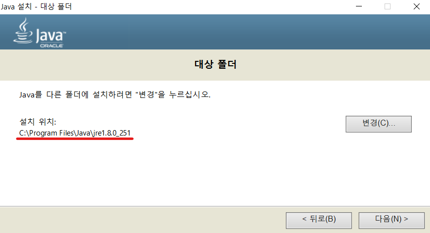
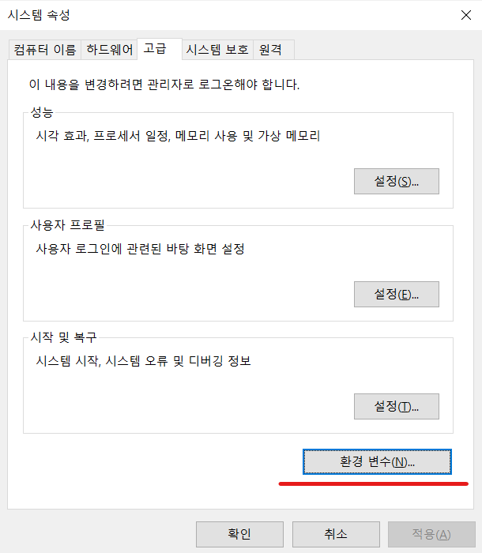
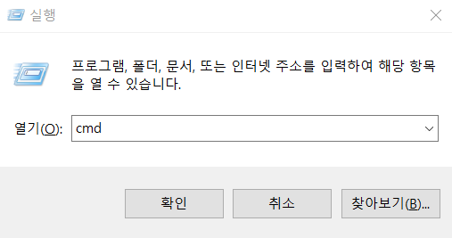

# Java with R 

## Windows 
### (1) 파일 다운로드
- 윈도우 10에서의 자바 설치 과정은 아래와 같습니다. 
- 우선 최신버전의 JDK를 다운로드 받고 실행합니다.(2020.5.4일 기준)
  + [Java SE 8u251](https://www.oracle.com/java/technologies/javase/javase-jdk8-downloads.html)을 다운로드 합니다. 
  + 하단에서 `Windows x64`에 해당하는 `jdk-8u*-windows-x64.exe`를 클릭하여 다운로드 합니다. 
    - 만약 본인 윈도우가 x64인지 x86인지 모르겠다면, 제어판-시스템에서 확인한다. 
  + 이 때 오라클 계정이 필요하니, ID와 패스워드를 꼭 확인하셔야 합니다. 
  + 노트북 환경 및 인터넷 상황에 따라 다르겠지만, 보통 1-2분 이내에서 다운로드 받을 수 있습니다. 
  + 다운로드가 완료된 뒤에는 프로그램 실행을 해야 하는데, 여기서 중요한 것은 파일의 경로이기 때문에 가급적 `C:\Program Files\Java\jdk1.8.0_251`가 올 수 있도록 합니다. 



- 위 경로를 꼭 기억해야 합니다. 

### (2) 환경변수 설정
- 설치 폴더까지 확인을 하셨다면, 이제 환경변수를 설정합니다. 
- 환경변수는 제어판-시스템 및 보안-시스템-고급시스템 순으로 클릭하여 설정에 들어갑니다. 
- 이때 시스템 속성 창에 고급 탭에서 환경변수를 클릭합니다. 



- 시스템 변수-새로만들기를 클릭하면 새 시스템 변수 창이 활성화 될 것입니다. 
  + 변수이름에는 `JAVA_HOME`이라고 기재합니다. 
  + 변수 값에는 `C:\Program Files\Java\jdk1.8.0_251`
  + 입력이 끝나면 확인 버튼을 눌러서 저장합니다. 
- 시스템 변수의 목록 중 `Path`를 클릭한 후 편집 버튼을 누릅니다.
  + 다른 것은 건드리지 않습니다. 
  + 새로만들기를 클릭 후 `%JAVA_HOME%\bin` 추가해줍니다.
- 설치 확인
  + 윈도우 키패드와 `R`을 동시에 누르면 실행창이 활성화 됩니다. 
  

  
  + `cmd`를 실행시키면 윈도우 명령프롬포트가 실행됩니다. 
  + 설치 확인을 위해 다음과 같은 명령어를 순차적으로 입력합니다. 
```
C:\Users\b> javac --version
javac 14.0.1
```

  